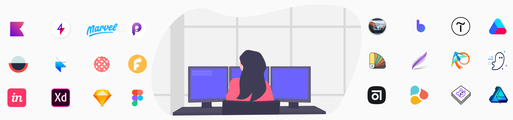

# Awesome Design Tools

    

 

## How to Use and Contribute

* Go through the Table of Contents and choose the tool.
* Search for a keyword or phrase (for example, "animation", "prototyping").
* Ask [Lisa](https://twitter.com/LisaDziuba) on Twitter.

If you found some great design tool, just send a Pull Request with respect to our [Contribution Guidelines](https://github.com/LisaDziuba/Awesome-Design-Tools/blob/master/Contribution_Guidelines.md) (they're very simple, please take a look). We use such labels for free , open source  and Mac only  tools, don't forget to add them. Now I'd love to see your suggestions!

## Table of Content

* [Accessibility Tools](#accessibility-tools)
* [Animation Tools](#animation-tools)
* [Augmented Reality](#augmented-reality)
* [Collaboration Tools](#collaboration-tools)
* [Color Picker Tools](#color-picker-tools)
* [Design Feedback Tools](#design-feedback-tools)
* [Design Handoff Tools](#design-handoff-tools)
* [Design Inspiration](#design-inspiration)
* [Design System Tools](#design-system-tools)
* [Design to Code Tools](#design-to-code-tools)
* [Design Version Control](#design-version-control)
* [Experience Monitoring](#experience-monitoring)
* [Font Tools](#font-tools)
* [Gradient Tools](#gradient-tools)
* [Icons Tools](#icons-tools)
* [Illustrations](#illustrations)
* [Information Architecture](#information-architecture)
* [Logo Design](#logo-design)
* [Mockup Tools](#mockup-tools)
* [No Code Tools](#no-code-tools)
* [Pixel Art Tools](#pixel-art-tools)
* [Prototyping Tools](#prototyping-tools)
* [Screenshot Software](#screenshot-software)
* [Sketching Tools](#sketching-tools)
* [Sound Design](#sound-design)
* [Stock Photos Tools](#stock-photos-tools)
* [Stock Videos](#stock-videos)
* [Tools for Learning Design](#tools-for-learning-design)
* [Tools for Marketing](#tools-for-marketing)
* [UI Design Tools](#ui-design-tools)
* [User Flow Tools](#user-flow-tools)
* [User Research Tools](#user-research-tools)
* [Visual Debugging Tools](#visual-debugging-tools)
* [Wireframing Tools](#wireframing-tools)
* [3D Modeling Software](#three-d-modeling-software)

<main>

    

<article id="accessibility-tools">

### Accessibility Tools

Accessibility is the practice of creating websites and apps usable for all people, including individuals with visual, motor, auditory, speech, or cognitive disabilities. Here you will find web accessibility tools, accessibility testing tools, and accessibility apps both for developers and designers:

* [Accessibility Insights](https://accessibilityinsights.io/) — helps developers quickly find and fix accessibility issues. 
* [AChecker](https://achecker.ca) — accessibility testing web app used to evaluate HTML content for accessibility problems. 
* [ANDI](https://www.ssa.gov/accessibility/andi/help/install.html) — accessibility testing tool for web content (bookmarklet). It will automatically detect accessibility issues, give suggestions to improve online accessibility and check 508 compliance.  
* [Axe](https://www.deque.com/axe/) — accessibility engine designed to work on all modern browsers and with whatever tools, frameworks, libraries and environments you use today. It's automated accessibility testing tool for developers.  
* [ColorBox](http://www.colorbox.io/) — a web app that algorithmically builds accessible color systems. Done by Lyft Design team. 
* [Contraste](https://contrasteapp.com/) — an app for checking the accessibility of text against the Web Content Accessibility Guidelines (WCAG). 
* [Contrast](https://usecontrast.com/) — a macOS app for designers and developers to get quick access to WCAG color contrast ratios. 
* [Hex Naw](https://hexnaw.com/) — helps you to test entire color systems for contrast and accessibility. 
* [PA11Y](http://pa11y.org/) — accessibility testing tool to find issues with your web pages. It runs HTML CodeSniffer from the command line for programmatic accessibility reporting. It's accessibility developer tool.  
* [Sim Daltonism](https://michelf.ca/projects/sim-daltonism/) — a color blindness simulator for macOS and iOS that lets you visualize colors as they are perceived with various types of color blindness.  
* [tota11y](http://khan.github.io/tota11y/) — an accessibility visualization toolkit. Interesting fact: inside the tool name you can see "a11y". It's an abbreviation of accessibility as "a" followed by 11 more letters, followed by "y". 
* [WAVE](https://wave.webaim.org/) — allows you to evaluate web content for accessibility issues directly within Chrome and Firefox. It's a web accessibility checker. 

Accessibility checking feature is also available in VisBug from [Visual Debugging Tools](https://github.com/LisaDziuba/Awesome-Design-Tools#visual-debugging-tools) categoty.

</article>

<article id="animation-tools">

### Animation Tools

Animations guide people through the product friendly and smoothly. Live interactive UI makes users feel delighted with instant feedback and emotional touch. These free and paid tools are designed to make animation creation easier. If you plan to make animated transitions, micro-interactions or scroll-based animations, go through these tools:

* [After Effects](https://www.adobe.com/products/aftereffects.html) — a digital visual effects, motion graphics, and compositing application developed by Adobe.
* [BeatFlyer](https://beatflyer.com/) — a web tool that lets you create very quickly loopy and catchy animations from your multi-layer compositions.
* [Flare](https://www.2dimensions.com/about-flare) — a powerful design and animation tool, which allows designers and developers to create animations for their app or game. 
* [Flow](https://createwithflow.com/) — a professional animation tool for Sketch designs that also exports production ready code for iOS, Web or SVG files. 
* [Haiku Animator](https://www.haikuforteams.com/) — keyframe-based animation connecting your UI tools to code that developers can easily use.
* [Keyshape](https://www.keyshapeapp.com/) — 2D animation tool that allows for animated SVG export.
  
* [Kite Compositor](https://kiteapp.co/) — a powerful animation and prototyping application for Mac & iOS. 
* [LightBox](https://uselightbox.com/) — 2D, Hand-Drawn animation package.  
* [Lottie](https://airbnb.io/lottie/) — a mobile library for Android and iOS that parses Adobe After Effects animations exported as json with Bodymovin and renders them natively on mobile and on the web. 
* [Mantra](https://jeremyckahn.github.io/mantra/) — a web-based timeline animation tool. 
* [Meteoritic](https://meteoritic.io/) — animation delights library for iOS and Android. Choose from a variety of animations that suits different app styles. 
* [OFFEO](https://offeo.com/) — an online video maker for small businesses to create video ads like the Big Brands without the big budget. 
* [Slider](https://sliderapp.co) — create stylish animated posts for Instagram and Facebook in just a few taps, all from your mobile phone.  
* [Spirit](https://spiritapp.io/) — the animation tool that helps you to create and manage the animations real time in the browser. 
* [Stylie](https://jeremyckahn.github.io/stylie/) — a web-based graphical CSS3 animation tool. 
* [Tumult Hype](https://tumult.com/hype/) — the HTML5 animation/interactives creation app for macOS. 

Principle, Framer, Invision Studio, Flinto are also among UI & UX animation apps and software animation tools.

</article>

<article id="augmented-reality">

### Augmented Reality

Augmented Reality is a technology that upgrades our real world, by adding a layer of digital information to it. The use of AR increases day by day with dozens of new AR apps, development kits, and AR frameworks. So in this section is collected different augmented reality tools for creating, projecting and prototyping apps focused on AR:

* [Daqri](https://daqri.com/) — delivers professional-grade augmented reality for the workforce by overlaying digital information onto the physical environment.
* [EasyAR](https://www.easyar.com/) — a mobile application and an Augmented Reality Engine, making AR easier.
* [HP Reveal](https://www.hpreveal.com/) — adding value to printed content through visual interactivity.
* [Layar](https://www.layar.com/) — find various items based upon augmented reality technology.
* [Lens Studio](https://lensstudio.snapchat.com/) — create, publish, and share your own AR experiences for Snapchat with or without code. 
* [Lightform](https://lightform.com/) — a design tool for projected AR.
* [Spark AR Studio](https://www.sparkar.com) — сreate AR experiences for Instagram without code.  
* [Torch](https://www.torch.app/) — a cloud-based 3D design and prototyping app focused on mobile AR.  
* [Unity](https://unity.com/) — build high-quality 3D and 2D games, deploy them across mobile, desktop and VR/AR.
* [Vectary](https://www.vectary.com/) — сreate 3D and AR for your website.
* [Vuforia](https://www.vuforia.com/) — SDK for mobile devices that enables the creation of augmented reality applications.
* [Wikitude](https://www.wikitude.com/) — empowers your iOS, Android & Smart Glasses apps with Image & Object Tracking, Instant tracking (SLAM), Geo AR, and more.

</article>

<article id="collaboration-tools">

### Collaboration Tools

Looking to try some tools for agile design and development collaboration? Good idea because such tools make the lives of designers and developers much easier, save time and improve productivity. Well, you know all that in Slack-driven era. Here you'll find the best collaboration tools for product teams:

* [Airtable](https://airtable.com/) — part spreadsheet, part database, and entirely flexible, teams use Airtable to organize their work, their way.
* [Appear.in](https://appear.in/) — a simple video collaboration tool.
* [Asana](https://asana.com/) — the work management platform teams use to stay focused on the goals, projects, and daily tasks that grow business.
* [Basecamp](https://basecamp.com/) — the project management suite designed to organize employees, delegate tasks, and monitor progress right from one place.
* [Filestage](https://filestage.io/) — an agile content approval software that helps you to review videos, designs and documents with clients and co-workers.
* [Gallery](https://material.io/tools/gallery/) — a collaborative tool for uploading design work, getting feedback, and tracking revisions.  
* [HiveDesk](https://www.hivedesk.com/) — an automatic time tracking for remote employees with screenshots. It makes it easier to monitor productivity of remote employees and manage projects.
* [Jira](https://www.atlassian.com/software/jira) — software development tool used by agile teams.
* [Keybase](https://keybase.io) — a free collaboration app with built-in end-to-end encrypted chat, file sharing, git repositories, and more  
* [Mattermost](https://mattermost.com/) — a flexible, open source messaging platform that meets even the most demanding privacy and security standards. 
* [Milanote](https://milanote.com/) — an easy-to-use, collaborative tool to organize your ideas and projects into visual boards.
* [Mixed](https://mixed.io) — real-time whiteboard and collaboration tools for distributed teams. 
* [MURAL](https://mural.co/) — think and collaborate visually. Anywhere, anytime.
* [Notion](https://www.notion.so) — write, plan, collaborate, and get organized. Notion is all you need — in one tool.
* [ProofHub](https://www.proofhub.com/) — the one place for all your projects, teams and communications.
* [RealtimeBoard (Miro)](https://www.realtimeboard.com/) — whiteboarding platform for cross-functional team collaboration. It was recently renaimed to Miro.
* [Slack](https://slack.com/) — a collaboration hub for work, no matter what work you do. It’s a place where conversations happen, decisions are made, and information is always at your fingertips.
* [Sunsama](https://sunsama.com/) — a beautifully designed, team oriented task manager that consolidates Trello/Jira/Asana tickets into a single, calendar-oriented view.
* [Taskade](https://taskade.com/) — team productivity made simple, fun and designed for remote teams. Taskade is collaborative and syncs in real-time across web, mobile and desktop.
* [Trello](https://trello.com/) — a web-based project management application that enables you to organize and prioritize your projects in a fun, flexible and rewarding way.
* [Witeboard](https://www.witeboard.com/) — simple real-time whiteboard for collaboration work. 
* [Workzone](https://www.workzone.com/) — a simple, powerful project management software.
* [Wrike](https://www.wrike.com/) — an online project management software that gives you full visibility and control over your tasks.
* [Zenkit](https://zenkit.com/) — a tool to schedule meetings, track project’s progress and brainstorm new ideas.

You can also have design collaboration into [InVision Freehand](https://www.invisionapp.com/feature/freehand) tool.

</article>

<article id="color-picker-tools">

### Color Picker Tools

If you are looking for an eyedropper tool, color identifier or color capture, check this section. With the color pickers mentioned here, you will be able to create new color combinations and define really great ones. Almost all of these tools are free:

* [Chroma](https://chroma.spencerhamm.com/) — free web app which allows you to identify the color. 
* [Color](https://color.adobe.com/explore/?filter=most-popular&time=month) — create color schemes with the color wheel or browse thousands of color combinations from the Color community. Made by Adobe. 
* [Colorwise](https://www.colorwise.io/) — search through the color palettes of the most voted products on Product Hunt. 
* [Colourcode](https://colourco.de/) — online designer tool, which allows you to easily and intuitively combine colours. 
* [Color Deck](https://color.obscuredetour.com/) — a HSL driven color palette collection. It's also open-source.  
* [Color Hexa](https://www.colorhexa.com/) — free color tool providing information about any color and generating matching color palettes for designs.
* [Colorpicker](https://colorpicker.crea-th.at/) — a complete and open-source colors manipulation tool with picking.  
* [Color by Cloudflare](https://cloudflare.design/color/) — a tool to preview palettes against UI elements, cycle through accessible color combos and reate palettes manually, via URL import, or generatively.
* [Colour Cafe](https://www.instagram.com/colours.cafe/) — colours inspiration that have selected modern colour palette in Instagram. 
* [Coolors](https://coolors.co/) — the super-fast color scheme generator.  
* [Culrs](https://culrs.com/#/) — thoughtfully crafted and easy-to-use color palettes. 
* [Geenes](https://geenes.app) — a tool to create harmonious color themes with code and sketch file export.
* [Instant Eyedropper](http://instant-eyedropper.com/) — a minimalist eyedropper tool for windows, supports multiple color formats for both designers and developers. 
* [Just Color Picker](http://annystudio.com/software/colorpicker/) — Free portable offline colour picker and colour editor. 
* [Khroma](http://khroma.co/) — AI-based tool to generate color palettes based on your preferences.
* [Material Colors Native](https://github.com/BafS/Material-Colors-native) — Google's material design color palette in the form of a mac app.   
* [Paletton](https://paletton.com) — a designer tool for creating color combinations that work together well. 
* [Picular](https://picular.co/) — a rocket fast primary color generator using Google's image search. 
* [Pikka](https://itunes.apple.com/us/app/pikka-color-picker/id1195076754) — color picker & color schemes generator for macOS. 
* [React Color](http://casesandberg.github.io/react-color/) — a collection of color pickers from Sketch, Photoshop, Chrome.  It‘s free and open-source.  
* [Sip](https://sipapp.io/) — a better way to collect, organize and share colors. Global eyedropper tool for MacOS. 
* [Skala Color](https://bjango.com/mac/skalacolor/) — works with a huge variety of formats, covering everything you’re likely to need for web, iOS, Android, and macOS development.  
* [Swatches](https://swatchesapp.io/) — iOS app that lets you collect, inspect and share the colors that inspire you in your daily life.  

</article>

<article id="design-feedback-tools">

### Design Feedback Tools

How do you provide and get feedback during the development process? This process is usually pretty messy for many product teams, which caused product delays and time waste on back-and-forth communication. So if you wish to get fast and structural feedback on UI issues or visual bugs — take a look at this tool:

* [Flawless Feedback](https://flawlessapp.io/feedback) — review and annotate iOS apps then share your feedback in Jira or Trello. 

</article>

<article id="design-handoff-tools">

### Design Handoff Tools

Design handoff happens when designers finish the work and need to deliver designs to developers with all specs and assets. Design handoff tools allow to automatically generate styleguide, comment on the design, inspect elements. These tools minimize guesswork and improve the effectiveness of the design process.

* [Avocode](https://avocode.com) — open designs without design tools. Export images without preparing layers. Click on layers to get code.
* [Flawless App](https://flawlessapp.io/) — a tool to compare the expected design and the real app right inside iOS Simulator (useful for designers who use Xcode or mobile developers). 
* [Inspect](https://www.invisionapp.com/feature/inspect/) — prepare designs for development. Made by Invision.
* [Sketch Measure](https://github.com/utom/sketch-measure) — Sketch redline plugin. Annotate distance and size of elements.  
* [Specctr](https://specctr.com) — in the unfortunate event you're designing UI in PS, AI, or ID this tool creates redline annotations.
* [Sympli](https://sympli.io) — automated specs and assets handoff from Sketch, Photoshop and Adobe XD. Integrated with Jira, Xcode and Android Studio.
* [Zeplin](https://zeplin.io/) — handoff designs and styleguides with accurate specs, assets, code snippets automatically.

You can also make design handoff within Relay, mentioned in the Design Version Control section.

</article>

<article id="design-inspiration">

### Design Inspiration

The creative process can be tough. So if ideas don’t come to your mind right away, try to search for inspiration in the work of other designers. These design inspiration sites feature design patterns, user flows, email markups and creative solutions of popular companies and great products:

* [Behance](https://www.behance.net/) — an online platform to showcase & discover creative work. 
* [CodeMyUI](https://codemyui.com/) — handpicked collection of web design & UI inspiration with code snippets. 
* [Collect UI](http://collectui.com/) — a platform for your daily inspiration collected from daily ui & beyond. Based on Dribbble shots, 14419 hand picked designs. 
* [Creative Portfolios](http://www.creative-portfolios.com/) — a curation of the most creative portfolios made by designers & developers.
* [Dribbble](https://dribbble.com/) — an online community for showcasing user-made artwork. Great resource to get inspired from others work.
* [Inspiration UI](http://inspirationui.com/) — community that aims to provide the best design resources for those who create for the web. 
* [Hover States](https://hoverstat.es/) — showcase great work from the bleeding edge of digital culture for, and with, the creative community.
* [Httpster](https://httpster.net/) — an inspiration resource showcasing totally rocking websites made by people from all over the world. 
* [H69.Design](https://www.h69.design/) — landing page colletions & Free resources for designers.
* [Lapa Ninja](https://www.lapa.ninja/) — landing page design inspiration from around the web. 1800+ landing page examples and updated daily.
* [Microcopy Inspirations](https://www.microcopyinspirations.com) — curated examples of good microcopy on websites and apps.
* [Mobile Patterns](https://www.mobile-patterns.com/) — a design inspirational library featuring finest UI UX Patterns (iOS and Android).
* [Mobbin](https://mobbin.design/) — browse mobile design patterns for popular apps. Explore common user flows such as onboarding, account sign up and log in, core functionality, and more. 
* [One Page Love](https://onepagelove.com/gallery) — a collection of beautiful unique One Page websites for website design inspiration. 
* [Owwly](https://owwly.com/feed/inspirations) — home for digital products crafted with passion to design.
* [Page Flows](https://pageflows.com/) — user flow videos and screenshots to inspire you when you're stuck. Discover mobile and web design patterns for over 160 different tasks. 
* [pttrns](https://pttrns.com/) — design patterns for popular mobile apps.
* [Really Good Emails](https://reallygoodemails.com/) — 4,150+ handpicked email design. 
* [ReallyGoodUX](https://www.reallygoodux.io/) — screenshots and examples of great UX from real mobile and web products. Discover the best UX examples—including onboarding tours and walkthroughs. 
* [The Design Team](https://thedesignteam.io/) — comics about a design team for a tech startup in Silicon Valley.
* [Typewolf](https://www.typewolf.com/) — helps designers choose the perfect font combination for their next design project.
* [UI Garage](https://uigarage.net/) — the one stop shop for designers, developers and marketer to find inspiration, tools and the best resources.
* [UI Sources](https://www.uisources.com/) — over 500+ interactions from the best designed and top grossing apps on the App Store today.  
* [UI Recipes](https://uirecipes.com/) — weekly 15 min lessons on UI design from the hottest apps.
* [UX Archive](http://uxarchive.com/) — browse more than 400 user flows across 120 mobile apps. Examine tasks such as booking, logging in, onboarding, purchasing, seaching, and more. 
* [Waveguide](https://www.waveguide.io/) — a design knowledge bank with thousands of artificially enriched examples of product and brand experience (examples of Mobile App, Landing pages, eCommerce, CX/UX Patterns).
* [Web Design Museum](https://www.webdesignmuseum.org/) — over 1,200 carefully selected web sites that show web design trends between the years 1994 and 2006.

</article>

<article id="design-system-tools">

### Design System Tools

I bet you heard about Design Systems, as it’s a pretty trendy topic. Design systems provide consistent, robust design patterns to keep design and development in sync. They are essentially collections of rules, constraints, and principles, implemented in design and code. Here you can find tools to build, maintain and organize your own design system.

* [Cabana](https://cabanadesignsystem.com/) — a Premium Design System for Sketch that helps you create amazing products faster than ever before.
* [Design System Manager](https://www.invisionapp.com/design-system-manager/) — Invision's design system manager.
* [EOS Design System](https://www.eosdesignsystem.com) — an open source and customizable built on top of Bootstrap following the Atomic Design concept. 
* [Frontify](https://frontify.com/) — create graphical guidelines, patterns libraries, design systems.
* [Lingo](https://www.lingoapp.com/) — create a shared asset library with your entire team. 
* [Lucid](https://lucid.style/) — tool for creating, managing and sharing a design system. From a simple component library through to detailed descriptions of your styles.
* [Prime Design System Kit](https://www.primedesignsystem.com) — it includes device templates, charts, UI kit and even illustration kit. 
* [Specify](https://www.specifyapp.com/) — a tool to create, scale and maintain a design system.
* [Symbol Design System](https://symboldesign.co/) — design System for Sketch based on atomic elements.
* [Zeroheight](https://www.zeroheight.com/) — styleguides created by designers, extended by developers, and editable by everyone.

We can also add to this in Sketch, Figma, UXPin and Framer X ([Framer X Team Store](https://www.framer.com/design-systems/)).

</article>

<article id="design-to-code-tools">

### Design to Code Tools

Everyone can learn development but it takes time and effort. If you need a website or an app right now and you don’t want to hire a developer, pay attention to the website builders. Such design to code tools will help you to make a portfolio, simple landing or an app pretty fast and beautiful.

* [Blocs](https://blocsapp.com/) — a fast, easy to use and powerful visual web design tool, that lets you create responsive websites without writing code. 
* [Bootstrap Studio](https://bootstrapstudio.io/) — a powerful web design tool for creating responsive websites using the Bootstrap framework.
* [Grapedrop](https://grapedrop.com/) — design your components, web projects and publish them instantly online, with an easy to use editor.
* [Mason](https://www.trymason.com/core) — is a feature-building platform where modern product teams design, build, and deploy front-end features together.
* [Mobirise](https://mobirise.com/) — an offline drag and drop website builder software that is based on Bootstrap 3/4 and \ AMP. 
* [PageCloud](https://www.pagecloud.com/) — the fastest and most customizable website builder that allows anyone to create their ideal website.
* [Pinegrow](https://pinegrow.com/) — a professional visual editor for CSS Grid, Bootstrap 4 and 3, Foundation, responsive design, HTML, and CSS.
* [px.div](https://www.pxdiv.com) — Proper site build tool for developers and designers.
* [Readymag](https://readymag.com/) — a visually-pleasing tool for designing on the web from landing pages to multimedia long-reads, presentations and portfolios.
* [Sparkle](https://sparkleapp.com/) — the easiest way to make a real website, no code, no jargon. 
* [STUDIO](https://studio.design/) — design from scratch, collaborate in real time and publish websites.
* [Tilda](https://tilda.cc/) — create a website, landing page or online store for free with the help of Tilda modules and publish it on the same day.
* [Wix](https://www.wix.com/) — the easiest and fullest-featured website builder, that allows you to create your own highly customized site.
* [Webflow](https://webflow.com/) — build responsive websites in your browser, then host with us or export your code to host wherever.

</article>

<article id="design-version-control">

### Design Version Control

Developers actively use version control tools for a long time, probably since 2005 (Git first release). Using a version control system is no brainer for dev teams, while design version control system appeared only recently. This market is rapidly developing and we expect to see even more in version control for designers:

* [Abstract](https://www.abstract.com/) — a platform for design teams to version, manage and collaborate on Sketch files.
* [Folio](http://folioformac.com/) — a simple version control system for design teams based on Git. 
* [Kactus](https://kactus.io/) — design version control without changing your tools. Manage changes, document work and keep your team in sync. 
* [Plant](https://plantapp.io/) — Mac app and Sketch plugin offering complete version control for designers and teams. 
* [Relay for Figma](https://relay.graphics/) — Relay pushes your latest assets from Figma directly to your codebase (not released yet).
* [Versions](https://versions.sympli.io) — a version control tool for designers with visual diff, merge and conflict resolution. Works with GitHub, Bitbucket, GitLab and Azure Devops.

</article>

<article id="experience-monitoring">

### Experience Monitoring

Listening to users is important but seeing the real usage is even more crucial. For these, you need to install different analytic tools, experience monitoring software, and user behavior apps. Just use those analytics solutions with respect to users data:

* [Amplitude](https://amplitude.com/) — understand your users, rapidly release better product experiences, and grow your business.
* [Chalkmark](https://www.optimalworkshop.com/chalkmark) — increase your customer conversion and task oriented success rates by getting quick feedback on designs before you implemen.
* [Fathom](https://usefathom.com/) — provides simple, useful websites stats without tracking or storing personal data of your users.
* [FullStory](https://www.fullstory.com/) — an app that captures all your customer experience data in one powerful, easy-to-use platform.
* [Google Analytics](https://analytics.google.com/analytics/web/) — measure your advertising ROI and track your sites and applications. 
* [Heap](https://heapanalytics.com/) — automatically capture every web, mobile, and cloud interaction then retroactively analyze your data without writing code.
* [Hotjar](https://www.hotjar.com/) — see how visitors are really using your website and collect user feedback.
* [Inspectlet](https://www.inspectlet.com/) — record videos of your visitors as they use your site, so you can see everything they do.
* [LogRocket](https://www.logrocket.com/) — see what users do on your site, helping you reproduce bugs and fix issues faster.
* [Mixpanel](https://mixpanel.com/) — get insights across all of your user-centric data to make smarter decisions and act faster based on how customers use your product or website.
* [Mouseflow](https://mouseflow.com/) — record mouse cursor movements.
* [Pendo](https://www.pendo.io/) — measure and elevate the customer experience within their applications.

</article>

<article id="font-tools">

### Font Tools

Fonts are commonly used for making the web a more beautiful place. It’s an essential part of any design. In this section, you’ll find fonts generators & font finder tools that allow you to manage and work with fonts:

* [Fontbase](https://fontba.se/) — font management made easy. 
* [FontPair](https://fontpair.co/) — a simple tool that helps you pair Google Fonts together. 
* [Fontface Ninja](https://fontface.ninja/) — browser extension to discover what fonts are being used on any website.
* [Fonts](https://fonts.adobe.com/fonts) — thousands of beautiful fonts by Adobe. 
* [FontSpark](https://fontspark.app/) — a simple tool to help designers quickly find the best fonts for their projects. 
* [Font Squirrel](https://www.fontsquirrel.com/fonts/acherus-grotesque) — download free fonts with wide collections.
* [Google Fonts](https://fonts.google.com/) — making the web more beautiful, fast, and open through great typography. 
* [Google Webfonts Helper](https://google-webfonts-helper.herokuapp.com/) — a hassle way to self-host Google Fonts. It‘s free and open-source.  
* [RightFont](https://rightfontapp.com/) — font managing app, helps preview, sync, install and organize fonts over iCloud, Dropbox or Google Drive. 
* [Sans Forgetica](http://sansforgetica.rmit/) — a downloadable font that is scientifically designed to help you remember your study notes. 
* [Typeface](https://typefaceapp.com/) — font manager that improves your design workflow with live font previews and flexible tagging. 
* [Wakamai Fondue](https://wakamaifondue.com/) — the tool that answers the question "what can my font do?". 
* [Webfont](https://webfontapp.com/) — create and maintain custom SVG icon fonts, made a shared library of icons.  

You can also handle fonts with Specify, which is mentioned in the [Design System Tools](https://github.com/LisaDziuba/Awesome-Design-Tools#design-system-tools) section.

</article>

<article id="gradient-tools">

### Gradient Tools
You can see gradient colors are everywhere — UI, branding, illustration, typography. A gradient is created by using two or more different colors to paint one element while gradually fading between them. It might look as memorable, fresh and unique color. To make such gradient for your design, use these gradient color palettes.

* [Blend](http://www.colinkeany.com/blend/) — create and customize beautiful CSS3 gradients. 
* [Colorffy](https://www.colorffy.com/) — get css, images, ui previews or create your own gradients. 
* [ColorSpace](https://mycolor.space/) — the perfect matching color scheme for your next project! Generate nice color palettes. 
* [ColorSpark](https://colorspark.app/gradient) — helps designers find unique colors and striking gradient combinations. 
* [Cool Backgrounds](https://coolbackgrounds.io/) — explore a beautifully curated selection of cool backgrounds that you can add to blogs, websites.
* [CoolHue](https://webkul.github.io/coolhue/) — handpicked gradient palette and swatch for your next super amazing stuff. 
* [CSS Gradient](https://cssgradient.io/) — a free css gradient generator tool, this website lets you create a colorful gradient background. 
* [Egg Gradients](https://www.eggradients.com/) — a color collection page which includes shades of 12 different colors. 
* [Grabient](https://www.grabient.com/) — beautiful and simple UI for generating web gradients. 
* [Gradient Backgrounds](https://cssgradient.io/gradient-backgrounds/) — discover the best gradient backgrounds from a curated collection of the ultimate list of gradient sites. 
* [Gradient Hunt](https://gradienthunt.com/) — a free and open platform for colour inspiration with thousands of trendy hand-made colour gradients.  
* [Gradients Guru](http://gradientsguru.com/) — blend mode background images & beautiful background gradients for your UI. 
* [HtmlColours](https://htmlcolors.com/) — realize how easy and beautiful is to create gradients with this gradients generator. 
* [UI Gradients](https://uigradients.com/) — handpicked collection of beautiful color gradients for designers and developers. 
* [Web Gradients](https://webgradients.com/) — a free collection of 180 linear gradients that you can use as content backdrops in any part of your website. 

</article>

<article id="icons-tools">

### Icons Tools

As well as fonts, icons are used in every design. These basic elements support and guide many user actions inside the product. Without a doubt, icons are a vital element in user navigation. While making those small design elements is hard and time-consuming, you can get thousands of vector icons for personal and commercial use.

* [Animaticons](http://animaticons.co/) — animaticons are a growing set of beautiful, high-resolution, animated GIF icons that you can customize.
* [Digital Nomad Icons](http://digitalnomadicons.com/) — lifestyle icon & emoji pack for your next project. 25 high resolution flat icons. 
* [Essential Glyphs](https://interface.market/essential/basic-pack) — created to cover your needs in perfect-shaped icons. Adapted for small and large sizes. 
* [Feather Icons](https://feathericons.com/) — each icon is designed on a 24x24 grid with an emphasis on simplicity, consistency and readability. 
* [Flaticon](https://www.flaticon.com/) — 1593000+ vector icons in SVG, PSD, PNG, EPS format or as icon font.
* [Font Awesome](https://fontawesome.com/) — the web's most popular icon set and toolkit, also it's open source. 
* [Fontello](http://fontello.com/) — tool to build custom fonts with icons, also open source.  
* [Iconscout](https://iconscout.com/) — get high-quality Icons, Illustrations and Stock photos at one place.
* [Iconfinder](https://www.iconfinder.com) — a marketplace for vector icons (SVG). Icon sets available in IconJar format.
* [IconJar](https://www.geticonjar.com/) — store all your icons in one icon manager. 
* [Iconmonstr](https://iconmonstr.com/) — discover 4412+ free icons in 305 collections.Big and continuously growing source of simple icons. 
* [Icon Store](https://iconstore.co/) — a library of free vector icons for personal and commercial projects, designed by first-class designers. 
* [ICONSVG](https://iconsvg.xyz/) — a tool to simplify the process of finding and generating common icons for your project. 
* [Icons8](https://icons8.com/icons) — free iOS, Android and Windows styled icons. 
* [Ikonate](https://www.ikonate.com/) — customise, adjust and download free vector icons. 
* [illustrio](https://illustrio.com/) — a smarter icon library. Build something great with 100% customizable icons. 
* [Ionicons](https://ionicons.com/) — beautifully crafted open source icons. 
* [Material Design Icons](https://materialdesignicons.com/) — free material design icons made possible by open source contributons.  
* [Material Icons Library](https://icons.pixsellz.io/) — free collection of 1000+ icons for popular graphics tools. 
* [Noun Project](https://thenounproject.com/) — icons for everything. 
* [Nucleo](https://nucleoapp.com/) — a Mac and Windows app to collect, customize and export all your icons. 
* [Simple Icons](https://simpleicons.org/) — free SVG icons for popular brands. Simply click the icon you want, and the download should start automatically. 
* [Streamline Emoji](http://emoji.streamlineicons.com/) — a free collection of 850 + vector emoji. The style is inspired by the japanese “Kawaii” (cute) style. 
* [Svgsus](http://www.svgs.us/) — SVG icon management tool. 
* [Tilda Icons](https://tilda.cc/free-icons/) — download free icons for landing pages. More than 700 vector icons, collected in 43 sets for business. 
* [Unicons](https://iconscout.com/unicons) — 1000+ pixel-perfect vector icons and Iconfont for your next project. 
* [VisualPharm](https://visualpharm.com/) — free SVG Icons with super-fast search and free Coke. Built for fun by Icons8. 
* [Xicons](https://www.xicons.co/) — free (do whatever you want) vector icons. A new icon pack every 10 days. 
* [Zwicon](https://www.zwicon.com/) — handcrafted iconset for your next project. 

You can also handle icons with Specify, which is mentioned in the [Design System Tools](https://github.com/LisaDziuba/Awesome-Design-Tools#design-system-tools) section.

</article>

<article id="illustrations">

### Illustrations

Illustrations can be used on your landing page, blog posts, inside your app or email campaign. They make your design live and playful. While drawing good illustration is a task of a skilled graphic designer, you can grab free SVG images & illustrations from very kind people in our community:

* [Absurd Design](https://absurd.design) — free surrealist illustrations for your projects. 
* [DrawKit](https://www.drawkit.io/) — a collection of fully customisable SVG illustrations, in two styles, available to use on your next project, app, or website. 
* [LukaszAdam](https://lukaszadam.com/illustrations) —  free vector art illustrations and icons. They are available for personal and commercial use. 
* [ManyPixels](https://gallery.manypixels.co) — royalty-free illustrations to power up your projects. 
* [Ouch](https://icons8.com/ouch) — vector illustrations to class up your project. Free for both personal and commercial use. 
* [unDraw](https://undraw.co) — collection of beautiful SVG images. 

</article>

<article id="information-architecture">

### Information Architecture

Information architecture helps designers organize and structure content inside websites, mobile apps, and other software. So users will understand product functionality and will find everything needed. These information architecture tools should allow you to create visual sitemaps and to improve your website content structure:

* [DYNO Mapper](https://dynomapper.com/) — organize website projects using visual sitemaps, content inventory, content audit, content planning, daily keyword tracking, and website accessibility testing.
* [OmniGraffle](https://www.omnigroup.com/omnigraffle/) — сreate beautiful diagrams and designs with this powerful and easy to use app.
* [OptimalSort](https://www.optimalworkshop.com/optimalsort) — card sorting tool that allows you to understand how people categorize content in your UI.
* [Treejack](https://www.optimalworkshop.com/treejack) — upload your proposed sitemap to see how a user would move through your site.

</article>

<article id="logo-design">

### Logo Design

A logo is the starting point of your brand identity. It reflects the product mission, functionality and brand message. Ideally, the logo creates a strong connection between your product and the users. Logo design is an art, as well as many other design disciplines. With the right logo design tools, this art can be done right a bit faster.

* [Design Evo](https://www.designevo.com/) — a large collection of vector icons and shapes help you design custom logos easily. 
* [Free Logo Design](https://www.freelogodesign.org/) — create stunning professional logos in seconds. 
* [Graphic Springs](https://www.graphicsprings.com/) — choose from a gallery of vector format logo templates, categorized by industry. Edit the graphics and texts of your template, then download.
* [Logo Design Team](https://www.logodesignteam.com/) — offers affordable professional custom logo design and brand design services.
* [Logojoy](https://logojoy.com/) — uses artificial intelligence to instantly generate unique logo ideas for your business.
* [Logo Lab](https://logolab.app/home) — put your logo to the test with automated visual experiments. 
* [Logo Maker](https://www.ucraft.com/free-logo-maker) — allows you to make a free logo within seconds. Start with a blank canvas, add text and an icon, and then customize. 
* [Logo Maker](https://www.designhill.com/tools/logo-maker) by Designhill — generate 1000s of unique logos in only few minutes, without design expertise.
* [Logo Makr](https://logomakr.com/) — design a logo for free, choose from hundreds of fonts and icons, then save a logo on the computer. 
* [Logo My Way](https://www.logomyway.com/) — choose from 600 custom logo designs from creative designers worldwide.
* [Logo Package Express](http://thelogopackage.com) — export and package dozens of logo variations and file types for your clients automatically in under 5 minutes.
* [Logo Rank](https://brandmark.io/logo-rank/) — upload your logo to see how it rates on a number of objective measures. 
* [Wizlogo](https://wizlogo.com/) — create a logo with simple and affordable tool backed by professional designers.

You can also do your logo design with Adobe Photoshop, GIMP, Inkscape, Krita and Vectr which are mentioned in [UI design tools](https://github.com/LisaDziuba/Awesome-Design-Tools#ui-design-tools).

</article>

<article id="mockup-tools">

### Mockup Tools

A mockup is a visual way of representing the product. While a wireframe mostly represents a product’s structure, a mockup shows how the product is going to look like. These mockup tools that help you create and collaborate on mockups, wireframes, diagrams, and prototypes:

* [Artboard Studio](https://artboard.studio/) — is world's the first online graphic design application mainly focused on product mockups.
* [Cleanmock](https://cleanmock.com) — create stunning mockups using latest device frames like iPhone & custom backgrounds.
* [Craftwork Design](https://craftwork.design/) — free and premium high quality digital products which make your work faster and easier.
* [Devices by Facebook](https://facebook.design/devices) — images and Sketch files of popular devices. 
* [Dimmy.club](https://dimmy.club/) — device mockup generator for your website and app screenshots.
* [Frrames](https://frrames.com/) — Frrames mockups is perfectly crafted responsive windows mockups for your ideal presentation.
* [Lstore Graphics](https://www.ls.graphics/) — free and premium mockups, UI/UX tools, scene creators for busy designers. 
* [Mockflow](https://www.mockflow.com/) — the quickest way to brainstorm user interface ideas.
* [Mockup World](https://www.mockupworld.co/) — tons of free and legal, fully layered, easily customizable photo realistic PSDs. 
* [Mockups For Free](https://mockupsforfree.com/) — free design resources, PSD files for graphic and web designers. 
* [Mockuuups](https://mockuuups.studio/) — drag-and-drop tool for creating beautiful app previews or any marketing materials.
* [Mock Video](https://www.mock.video/) — instantly create mockups by adding a device frame to your videos.
* [Moqups](https://moqups.com/) — helps you create and collaborate in real-time on wireframes, mockups, diagrams and prototypes.
* [Overframe for Mac](https://overframe.xyz/) — record your prototype & app with device frame overlay. 
* [PixelBuddha](https://pixelbuddha.net/) — free and premium high quality resources for web designers and developers.
* [Ramotion Store](https://store.ramotion.com/) — carefully crafted Apple and Android mockups for Sketch and Photoshop.
* [Rotato](https://www.rotato.xyz/) — animated 3D mockups for your app designs. 
* [Screely](https://www.screely.com/) — quickly frame web page designs into a minimalist browser window. 
* [ScreenSpace](https://www.screenspace.io/) — 3D devices videos for motion designer.
* [Smartmockups](https://smartmockups.com/) — create stunning product mockups with just a few clicks.
* [shotsnapp](https://shotsnapp.com/) — create beautiful device mockup presentation for your digital app and website design.
* [The Mockup Club](https://themockup.club/) — a directory of the best free design mockups for Photoshop, Sketch, Figma and InVision Studio. 
* [Threed](http://threed.io/) — generate custom 3D Device Mockups in your Browser.
* [UI Store Design](https://www.uistore.design/) — 200+ free handpicked design resources for Sketch, Figma, Adobe XD, InVision Studio, Photoshop, Illustrator CC. 
* [UI8 - Design Freebies](https://ui8.net/category/freebies) — epic design freebies to get you started. 
* [Vector Mockups Library](https://mockups.kkuistore.com/) — free collection of presentation Mockups for Sketch, Figma & Photoshop. 

</article>

<article id="no-code-tools">

### No Code Tools

With a rise of “no code tools”, everyone with a laptop can build and launch a project. These tools help designers and makers create websites, apps, and even games. No code tools allow to automate routine tasks and can be used without a development background. Take a look at the tools here and if you need more — check Design to Code section.

* [Bubble](https://bubble.is/) — build and host web applications without having to write code or hire a team of engineers.
* [Carrd](https://carrd.co/) — simple, free, fully responsive one-page sites for pretty much anything. 
* [Coda](https://coda.io) — a new type of document that blends the flexibility of documents, the power of spreadsheets, and the utility of apps into a single new canvas. 
* [PageXL](https://pagexl.com/) — a simple one-page website builder for quickly creating landing pages. 
* [Remove.bg](https://www.remove.bg/) — is a free service to remove the background of any photo. 
* [Retool](https://tryretool.com/) — gives you building blocks and you can build tools much faster.
* [Sheet2Site](https://www.sheet2site.com/) — create a website from Google Sheets without writing code.
* [Shopify](https://www.shopify.com/) — one platform with all the ecommerce and point of sale features you need to start, run, and grow your business.
* [Thunkable](https://thunkable.com/) — a drag-and-drop tool for anyone to build native mobile apps.

</article>

<article id="pixel-art-tools">

### Pixel Art Tools

Pixel art is a digital art form where color is applied to individual pixels to create an image. The pixel art can be used to create everything from intricate scenes and game backgrounds to character designs or emoji. If you feel curious to try, check this pixel art software for both macOS and Windows:

* [Aseprite](https://www.aseprite.org/) — animated sprite editor & pixel art tool.
* [Data Pixels](https://github.com/gmattie/Data-Pixels) — create pixel art programmatically. Includes DataPixels.js and Data Pixels Playground desktop app.  
* [Grafx2](https://gitlab.com/GrafX2/grafX2) — a bitmap paint program inspired by the Amiga programs ​Deluxe Paint and Brilliance. Specialized in 256-color drawing. [open-source.svg](https://github.com/LisaDziuba/Awesome-Design-Tools/blob/master/Media/open-source.svg) 
* [GraphicsGale](https://graphicsgale.com/us/) — has many pixel-art specific features, including palette control, selectively erasing colors, and tools for quickly replacing and trying new colors. 
* [Goya](https://jackschaedler.github.io/goya/) — a pixel-art editor built on ClojureScript and Om.  
* [Make 8 bit art](https://make8bitart.com/) — an open source and in-browser pixel art drawing tool.  
* [Piskel](https://www.piskelapp.com/) — online editor for animated sprites & pixel art.  
* [Pixel art to CSS](https://www.pixelartcss.com/) — pixel art animation and drawing web app powered by React.  
* [Poxi](http://app.poxi.rocks/) — a flat pixel art editor.  
* [Pyxel Edit](https://pyxeledit.com/) — a pixel art editor designed to make it fun and easy to make tilesets, levels and animations.  

</article>

<article id="prototyping-tools">

### Prototyping Tools

A prototype is a simple experimental design of a proposed solution. It should help to test ideas, design assumptions, and hypothesis in a fast and cheap way. Prototyping tools allow designers and clients to see how the product would function in the real world and collaborate on this solution. Many modern prototyping tools can use for wireframing, prototyping, and collaboration:

* [Alva](https://www.meetalva.io/) — create living prototypes with code components. It's also open source.  
* [Axure RP](https://www.axure.com/) — wireframing, prototyping, collaboration & specifications generation.
* [Balsamiq](https://balsamiq.com/) — wireframing and collaboration.
* [SAP Build](https://www.build.me/) — a complete set of cloud‑based tools to design and build your enterprise app.
* [Creo](https://creolabs.com/) — prototyping, code exporting and built-in mobile app builder. 
* [InVision](https://www.invisionapp.com/) — prototyping, collaboration & workflow platform. 
* [Flinto](https://www.flinto.com/) — a Mac app for creating interactive and animated prototypes of app designs.
* [Framer X](https://framer.com/) — a tool to visually design realistic interactive prototypes. 
* [Keynote](https://www.apple.com/keynote/) — the built-in Mac app for creating presentations that can also be used for quick prototyping (see how Apple designers [use it](https://developer.apple.com/videos/play/wwdc2014/223/) to verify design concepts).  
* [Marvel App](https://marvelapp.com/) — the collaborative design platform. Wireframe, prototype, design online and create design specs in one place.
* [Maze](https://maze.design/) — a tool for designers and developers that gives analytical results with actionable KPIs for your Invision prototypes.
* [Pencil](https://pencil.evolus.vn/) — prototyping tool with many built-in components that people can easily install and use to create mockups in popular desktop platforms. 
* [Principle](https://principleformac.com/) — makes it easy to design animated and interactive user interfaces. 
* [ProtoPie](https://www.protopie.io/) — piece hi-fi interactions together, build sensor-aided prototypes and share your amazing creations in a matter of minutes.
* [Proto.io](https://proto.io/) — a tool to create fully-interactive high-fidelity prototypes that look and work exactly as your app should.
* [Uizard](https://uizard.io/) — transform wireframes into high-fidelity interactive prototypes, customize style systems, export to Sketch, export to HTML/CSS code. 
* [UXPin](https://www.uxpin.com/) — build prototypes that feel real, with powers of code components, logic, states and design systems. 

You can also do prototyping with Figma, Adobe XD, Sketch and InVision Studio, which are mentioned in the [UI Design Tools section](#ui-design-tools).

    

</article>

<article id="screenshot-software">

### Screenshot Software

Taking screenshots is a typical task in the design & development workflow. So these free and full-featured screenshot apps can help you capture a screen with ease. Some screen captures are macOS only, while others support both OS:

* [Camtasia](https://www.techsmith.com/video-editor.html) — a screen recorder that comes with full-blown built in editor.
* [CleanShot](https://getcleanshot.com) — capture your screen in a superior way with built-in annotation tool and Quick Access Overlay. 
* [CloudApp](https://www.getcloudapp.com/) — record videos, webcam, annotate screenshots, create GIFs.
* [Giphy Capture](https://giphy.com/apps/giphycapture) — capture parts of your screen and export as gif or mp4.  
* [Greenshot](https://getgreenshot.org/) — take a screenshot of a selected region, window or fullscreen. 
* [Kap](https://getkap.co) — open source screen recorder with options to export to GIF, MP4, WebM and APNG.   
* [Lighshot](https://itunes.apple.com/us/app/lightshot-screenshot/id526298438) — taking quick captures of your screen. 
* [Monosnap](https://itunes.apple.com/us/app/monosnap/id540348655?mt=12) — create screenshots, annotate and upload them to the cloud. 
* [OBS](https://obsproject.com/) — open source software for video recording and live streaming.  
* [Quicktime](https://support.apple.com/quicktime) — a video player that you can use to record your screen.  
* [ScreenFlow](http://www.telestream.net/screenflow/overview.htm) — video editing and screen recording 
software for Mac. 
* [Screenie](https://www.thnkdev.com/Screenie/) — filter and search through images, change screenshot filetypes. 
* [ScreenToGif](https://www.screentogif.com/) — record a gif of part of the screen. Only available for Windows.  
* [ShareX](https://getsharex.com/) — screen capture, file sharing and productivity tool.  
* [Snipping Tool](https://support.microsoft.com/en-us/help/13776/windows-use-snipping-tool-to-capture-screenshots) — Windows free screenshot tool. 
* [Snappy](http://snappy-app.com/) — takes quick shots and organizes them for you into collections.  
* [Teampaper Snap](https://teampaper.me/snap/) — allows you to take screenshots of a selected area.  

</article>

<article id="sketching-tools">

### Sketching Tools

Sometimes you need just a pencil and paper to start creating your app or website. So here are you can find online sketching tools with great sketch sheet templates to speed up your creative process:

* [Responsive Sketchsheets](https://zurb.com/playground/responsive-sketchsheets) — offers responsive pre-design templates. These will automatically adapt their layout to any screen size and include neat features. 
* [Sketchsheets](https://sketchsheets.com/) — an open source project dedicated to providing free printable templates of the latest devices and platforms for wireframing designs.  
* [Sneakpeekit](https://sneakpeekit.com/) — print note taking grids and devices frames. 
* [Sketchize](https://sketchize.com/) — just choose any of the sketch sheets that fits your project, print it out and start to sketch your dream. 

You can also do some sketching with Sketch mentioned in [UI design tools](https://github.com/LisaDziuba/Awesome-Design-Tools#ui-design-tools).

</article>

<article id="sound-design">

### Sound Design
Sound design is an art of creating a soundscape for a site, app, movie, game or any other product. The sound has great potential for transforming the way people connect with your product. Some sound design software is very advanced and can be used mostly by sound designers, while others are good for beginners.

* [Appsounds](https://appsounds.pro/) — UI Sound packs for apps, games, and any product.
* [AudioJungle](https://audiojungle.net/) — 836,206 tracks and sounds from the community of musicians and sound engineers.
* [Bensound](https://www.bensound.com/) — download creative commons music, royalty free music for free and use it in your project. 
* [Freesound](https://freesound.org/) — a collaborative database of Creative Commons Licensed sounds. Browse, download and share sounds. 
* [Fugue Music](https://icons8.com/music) — download free background music for your videos. 
* [Max](https://cycling74.com/products/max/) — connect objects with virtual patch cords to create interactive sounds, graphics, and custom effects.
* [Reaper](http://reaper.fm/) — import any audio and MIDI, synthesize, sample, compose, arrange, edit, mix, and master songs or any other audio projects.
* [Sonic Pi](https://sonic-pi.net/) — a live coding music synth.  
* [SoundKit](https://soundkit.io/) — a UI sound library designed for all of your interface needs.
* [UI Sounds](https://uisounds.prototypr.io/) — learn sound design for user interfaces by example.
* [Wistia Music](https://wistia.com/resources/music) — download some free background tracks to add energy and emotion to your videos. 
* [WOWA](https://www.wowa.me/) — download royalty free music for YouTube videos, Podcasts and Apps. No copyright CC0. Music inspired by Unsplash. 
* [YouTube Audio Library](https://www.youtube.com/audiolibrary/music) — browse and download free music for your project. 

</article>

<article id="stock-photos-tools">

### Stock Photos Tools

Need a high-quality photo for iOS app or new banner? You can always shoot it yourself or borrow from the stock photo sites. Luckily, there are hundreds of beautiful, free stock photos and royalty-free images that you can use for any project:

* [Burst](https://burst.shopify.com/) — free stock photos for websites and commercial use. 
* [Duotone](https://duotone.shapefactory.co/) — free duotone images to use in any project, or make custom duotone images. 
* [FoodiesFeed](https://foodiesfeed.com/) — thousands of beautiful realistic free food pictures in high resolution. 
* [FreePhotos.cc](https://freephotos.cc/) — free stock photos for commercial use. 
* [Freestocks.org](http://freestocks.org/) — high quality photos all released under Creative Commons CC0. 
* [Gratisography](https://gratisography.com) — collection of free high-resolution pictures. 
* [Jay Mantri](https://jaymantri.com/) — 7 new photos released every Thursday under the Creative Commons CC0. 
* [Kaboom Pics](https://kaboompics.com/) — stock photos including abstract, city/architecture, fashion, food & landscapes. 
* [LandingStock](https://landingstock.com/) — a collection of free images for your landing page. 
* [Life of Pix](https://www.lifeofpix.com/) — free high-resolution photos, created by the LEEROY team. 
* [Magdeleine](https://magdeleine.co/) — free high-quality stock photos for your inspiration. 
* [Moose](https://photos.icons8.com/) — don't search for stock photos, create them. 
* [MMT STock](http://mmtstock.com/) — high resolution photos provided by Jeffrey Betts with Creative Commons CC0. 
* [New Old Stock](https://nos.twnsnd.co/) — a vintage photos from the public archives free of known copyright restrictions. 
* [Pexels](https://www.pexels.com/) — an aggregate of many free stock photo resources. 
* [Photo Creator](https://photos.icons8.com/creator) — a free tool for creating realistic stock photos on your demand. 
* [Picography](https://picography.co/) — free stock photos by Dave Meier and various other photographers with Creative Commons CC0. 
* [Pixabay](https://pixabay.com/) — sharing photos, illustrations, vector graphics, and film footage under a proprietary license. 
* [Picjumbo](http://picjumbo.com/) — a collection of totally free photos for your commercial & personal works. 
* [Pngtree](https://pngtree.com/) — millions of PNG images, backgrounds and vectors for free download. 
* [pxhere](https://pxhere.com/) — free image stock. 
* [Reshot](https://www.reshot.com/) — a massive library of handpicked free stock photos you won’t find elsewhere. 
* [ShotStash](https://shotstash.com/) — thousands of free high-resolution CC0 photos and videos. 
* [SkitterPhoto](https://skitterphoto.com/) — a wide variety of stock photos and are released under Creative Commons CC0. 
* [Startup Stock Photos](http://startupstockphotos.com/) — free photos for startups, bloggers and publishers. 
* [StockSnap.io](https://stocksnap.io/) — a large selection of free stock photos and high resolution images. 
* [StyledStock](https://styledstock.co/) — free feminine stock photography for every woman entrepreneur. 
* [UI Faces](https://uifaces.co/) — aggregator that indexes various free avatar sources that you can use in your design mockups. 
* [Unsplash](https://unsplash.com) — stock photos free to use. 
* [#WOCinTech Chat Photos](https://www.flickr.com/photos/wocintechchat) — free stock photos of women technologists of diverse backgrounds. 
* [Zoommy](http://www.zoommyapp.com) — helps you find awesome free stock photos for your creative product or inspiration. 

</article>

<article id="stock-videos">

### Stock Videos
If you work with video-content, you will enjoy these high-quality, hand-curated stock videos. You'll find many good and free stock video sites below, which you can use on your website, in your ad campaigns or social media:

* [Coverr](https://coverr.co/) — beautiful, free stock video footage for your homepage. 
* [Life of Vids](http://www.lifeofvids.com/) — provides free stock videos, clips, and loops. 
* [Mazwai](http://mazwai.com) — great collection of free creative commons HD video clips & footages. 
* [Mixkit](https://mixkit.co/) — extraordinary Free HD videos. For you to use, completely free of charge. 
* [Motion Places](https://www.motionplaces.com/) — a curated collection of beautiful footage you can use for your projects. 
* [Pixabay](https://pixabay.com/) — it has more than 1.5 million royalty-free stock videos and photos shared by their community of creators. 
* [Pexels Videos](https://www.pexels.com/videos/) — makes it easy to find free stock footage for your website, promo video or anything else. 
* [Videezy](https://www.videezy.com/) — download millions of free and premium stock footage and motion graphics instantly.
* [Videvo](https://www.videvo.net/) — videvo offers a large selection of HD video clips, motion graphics and free stock footage. 
* [123RF](https://www.123rf.com/) — over 100,000 daily new content & 24/7 online support.

</article>

<article id="tools-for-learning-design">

### Tools for Learning Design

* [Design Better](https://www.designbetter.co/) — discover the best practices, stories, and insights from the world’s top design teams and leaders. 
* [Design+Code](https://designcode.io/) — complete courses about the best tools and design systems.
* [DesignerUp](https://designerup.co/) — a collection of self-paced courses and mentorship to help you master Product Design (UI/UX).
* [Laws of UX](https://lawsofux.com/) — a collection of the maxims and principles that designers can consider when building user interfaces. 
* [Learn UX](https://learnux.io/) — a complete approach to learning UI & UX Tools.
* [Sketch Master](https://sketchmaster.com/) — a collection of video training courses for professionals learning Sketch.

</article>

<article id="tools-for-marketing">

### Tools for Marketing

* [Canva](https://www.canva.com/) — create stunning designs for work, life, and play—even if you're not a design expert! 
* [Crello](https://crello.com/) — create your own designs: posts, covers, graphics, and posters using the best software on the web. 
* [Remove.bg](https://www.remove.bg/) — is a free service to remove the background of any photo. 
* [SocialSizes](https://socialsizes.io/) — provides designers with the best sizes to use for image and video content on social media. 

</article>

<article id="ui-design-tools">

### UI Design Tools

What are the best UI design tools in 2019? You can pick any of the tools below and it will allow you to do dozens of design tasks — UI for site or mobile, wireframe, prototype, animation, logo. These are great and fully-functional tools for UX & UI designers:

* [Adobe XD](https://www.adobe.com/products/xd.html) — design, prototype, and share any user experience, from websites and mobile apps to voice interactions. 
* [Affinity Designer](https://affinity.serif.com/en-gb/designer/) — a vector graphics editor for macOS, iOS, and Microsoft Windows.
* [Botmock](https://www.botmock.com) — design, prototype, and test voice and text conversational apps. Supports multiple platforms.
* [CleverBrush](https://www.cleverbrush.com/) — a browser-based online vector editor and digital publishing tool which is possible to integrate to page as JS component.
* [Figma](https://www.figma.com/) — a design tool based in the browser, that allows to design and prototype with real-time collaboration.
* [GIMP](https://www.gimp.org/) — a free & open source imaging and graphic design software.  
* [Gravit](https://designer.io/) — a free vector design app, available for macOS, Windows, Linux, ChromeOS and browser. 
* [Illustrator](https://www.adobe.com/products/illustrator.html) — create logos, icons, drawings, typography, and illustrations for print, web, video, and mobile. Made by Adobe.
* [Inkscape](https://inkscape.org/) — a free and open-source vector graphics editor. It has ability to create or edit vector graphics such as illustrations, diagrams, line arts, charts, logos and complex paintings.  
* [Krita](https://krita.org/en/) — a free painting and graphic design software considered a good alternative to Adobe Photoshop.  
* [Lunacy](https://icons8.com/lunacy) — a free native windows app that works offline and supports .sketch files. Flexible and light weighed. Intuitive and easy to use. Speedups and empowers UI and UX designers. The must have to produce stunning designs. 
* [Photopea](https://www.photopea.com/) — a free browser-based graphic design app alternative to Photoshop. 
* [Photoshop](https://www.adobe.com/products/photoshop.html) — imaging and graphic design software developed by Adobe.
* [Pixelixe](https://studio.pixelixe.com) — a graphic design tool built for marketers, bloggers and small businesses that needs to create stunning and unique images, graphics or static webpages in minutes. 
* [Sketch](https://www.sketchapp.com/) — a design toolkit built for Mac. 
* [Studio](https://www.invisionapp.com/studio) — combines design, prototyping, and collaboration into one harmonious workflow. Made by Invision.
* [Vectr](https://vectr.com/) — a simple web and desktop cross-platform tool to create vector graphics easily and intuitively. 

</article>

<article id="user-flow-tools">

### User Flow Tools

User flow is a series of steps a user takes to achieve a meaningful goal. It's a fast way to plan customer journey paths and improve UX. So if you need to make a user flow diagram, user flow map or a sitemap, take a look at these tools:

* [Draw.io](https://www.draw.io/) — a free online diagram software for making flowcharts, process diagrams, org charts, UML, ER and network diagrams. 
* [Flowmapp](https://flowmapp.com/) — an online tool for creating sitemaps and user flows that helps you to effectively design and plan user experience.
* [Google Drawings](https://docs.google.com/drawings/) — create diagrams and charts, for free; all within Google Docs. 
* [Lucidchart](https://www.lucidchart.com/) — online tool for creating diagrams, flow charts, sitemaps, and more.
* [MindNode](https://mindnode.com/) — a mind mapping app that makes brainstorming simple and easy.  
* [NinjaMock](https://ninjamock.com/) — wireframe and user flow online tool. Link your views and create logic flow prototype. All with freehand visual style.
* [OmniGraffle](https://www.omnigroup.com/omnigraffle/) — a diagramming and digital illustration application for macOS and iOS. 
* [Overflow](https://overflow.io/) — turn your designs into playable user flow diagrams that tell a story.
* [Sketch.systems](https://sketch.systems/) — ui and flow design with interactive state machines. 
* [SQUID](https://uxmisfit.com/squid/) — create beautiful User Flows in Sketch in just minutes. 
* [WebSequenceDiagrams](https://www.websequencediagrams.com/) — a simple webapp to work out object interactions arranged in time sequence. 
* [Whimsical](https://whimsical.co/) — easy to create flow charts, wireframes and sticky notes.
* [Wireflow](http://wireflow.co) — free, online and open source tool for creating beautiful user flow prototypes.  
* [XMind: ZEN](https://www.xmind.net/zen/) — a brainstorming and mind mapping tool that can switch between outline and tree-chart. Link topics with other charts.
* [yEd - Graph Editor](https://www.yworks.com/products/yed) — free desktop tool for making diagrams. Usable for wide variety of use cases. Auto-layout helps a lot when making flowcharts. 

</article>

<article id="user-research-tools">

### User Research Tools
User research helps you understand user behaviors, needs, and motivations through various qualitative and quantitative methods (interviews, observation, forms, etc). These user research tools can be useful for you:

* [Calendly](https://calendly.com/) — Calendly helps you schedule meetings without the back-and-forth emails.
* [Crowd Signal](https://crowdsignal.com/) — collect, organize and analyze data from a variety of sources, including social media and mobile.
* [Feedback Lite](https://www.feedbacklite.com/) — collect high quality customer feedback using Voice of Customer solutions designed to improve your website performance and boost customer engagement.
* [GoToMeeting](https://www.gotomeeting.com/en-gb) — a simple, extraordinarily powerful web conferencing service.
* [Lookback](https://lookback.io/) — remotely run, record, and take notes for your user research sessions, either with a live product or with a prototype.
* [Reflector](https://www.airsquirrels.com/reflector) — Reflector is a basic screen-mirroring and recording tool so you can conduct user tests remotely, using any existing wireframes or prototypes.
* [Reframer](https://www.optimalworkshop.com/reframer) — a research tool that helps your team to capture, tag (code) and identify patterns in qualitative data across multiple research participants.
* [Survey Monkey](https://www.surveymonkey.com/) — online survey tool to capture the voices and opinions of the people who matter most to you.
* [Typeform](https://www.typeform.com/) — use a simple drag-and-drop interface to create any kind of form, survey, or questionnaire, and even take credit card payments.
* [Wufoo](https://www.wufoo.com) — сreate forms, collect data and payments, and automate your workflows.
* [YesInsights](https://www.yesinsights.com/) — simple one question and NPS surveys to improve your business.
* [UserBit](https://userbitapp.com/) — a platform of real-time research tools for your team. Tag/code interviews and feedback, capture insights, create personas, visual sitemaps and more.
* [User Interviews](https://www.userinterviews.com/) — recruit participants from a community of 125,000 members based on profession, demographics, geography and more, for any kind of research.

    

</article>

<article id="visual-debugging-tools">

### Visual Debugging Tools

* [LogRocket](https://logrocket.com/) — a tool to record what users do on your site so you can reproduce bugs and fix issues faster.
* [PixelSnap](https://getpixelsnap.com) — the magical way to measure everything on your screen. 
* [VisBug](https://github.com/GoogleChromeLabs/ProjectVisBug) — on any webpage: visually debug, quick inspect style and a11y, change CSS visually, click and drag elements around, and much more.  
* [Visual Inspector](https://www.canvasflip.com/visual-inspector/) — collaboration tool for website feedback and fixing design bugs.

</article>

<article id="wireframing-tools">

### Wireframing Tools
A wireframe is a visual mockup that outlines the basic structure of the site or an app. It contains the most essential elements and the content, helping you easily explain ideas on design. Wireframes are a low-fidelity way of showing a design. In this section is presented the best wireframing tools for a variety of use cases.

* [Balsamiq Cloud](https://balsamiq.cloud/) — effortless UI sketching. Capture your ideas, collaborate on your designs, get everyone on board.
* [CSS Grid Builder](https://cssgrid.cc/css-grid-builder.html) — with this tool there is no HTML part to the grid. The grid only becomes apparent when content (elements) are added and positioned according to the grid rules. 
* [Gliffy](https://www.gliffy.com/) — a tool for creating the framework, UML diagrams, flowcharts, wireframes and more.
* [Gridzzly](http://gridzzly.com/) — the easiest way to create custom grid paper printable. 
* [Layoutit](https://grid.layoutit.com/) — a interface builder for CSS Grid & Bootstrap that wants to be the kick-off for your front-end developments. 
* [Pidoco](https://pidoco.com/en) — software that lets you quickly create click-through wireframes and fully interactive UX prototypes.
* [Wireframe.cc](https://wireframe.cc/) — a simple wireframing tool that doesn't get in your way. 
* [Whimsical Wireframes](https://whimsical.co/wireframes/) — instant wireframing at your fingertips. Rich library of configurable elements like buttons, inputs, checkboxes.
* [1200px Grid System](https://1200px.com/) — helps you build a grid system for much wider website designs than the 960-pixel style.

</article>

<article id="three-d-modeling-software">

### Three D Modeling Software
3D graphics are used in gaming, film making, architecture, engineering, and 3D printing. 3D artists & designers use specific 3D modeling software, mentioned in this section.

* [Autodesk](https://www.autodesk.com/products/fusion-360/overview) — integrated CAD, CAM, and CAE software. Unify design, engineering, and manufacturing into a single platform.
* [Blender](https://www.blender.org/) — free and open source 3D Creation Software.  
* [FreeCAD](https://www.freecadweb.org/) — a free and opensource multiplatform 3D parametric modeler.  
* [MatterControl](https://www.matterhackers.com/store/l/mattercontrol/sk/MKZGTDW6) — a free, open-source, all-in-one software package that lets you design, slice, organize, and manage your 3D prints.  
* [Maya](https://www.autodesk.com/products/maya/overview) — make animations, environments, motion graphics, virtual reality, and character creation, all in one toolset.
* [Onshape](https://www.onshape.com/) — a modeling software specially oriented to design technical and spare parts, was the first full-cloud 3D software created.
* [Rhino](https://www.rhino3d.com/) — a curve-based 3D modeling software that creates mathematically-precise models of 3D surfaces.
* [SketchUp](https://www.sketchup.com) — 3D design software that truly makes 3D modeling for everyone, with a simple to learn yet robust toolset.
* [Tinkercad](https://www.tinkercad.com) — a free, easy-to-use app for 3D design, electronics, and coding. 
* [Vectary](https://www.vectary.com/) — create beautiful 3D models with our drag and drop 3D modeling tool.
* [3D Slash](https://www.3dslash.net) — 3D modeling tool, available on all devices and all OS, online and offline.

</article>

<article id="addendum">

### Addendum (Reference & Inspiration)

Awesome Design Tools is curated by [Lisa Dziuba](https://twitter.com/LisaDziuba) & [Valia Havruliyk](https://twitter.com/ValiaHavryliuk) from Flawless team. And it was hugely inspired by articles from the design community and Prototypr.io Toolbox made by our good friend Graeme Fulton. If you found some great design tool, please [suggest it](https://github.com/LisaDziuba/Awesome-Design-Tools/blob/master/Contribution_Guidelines.md). Thanks for making this project awesome :)

</article>
